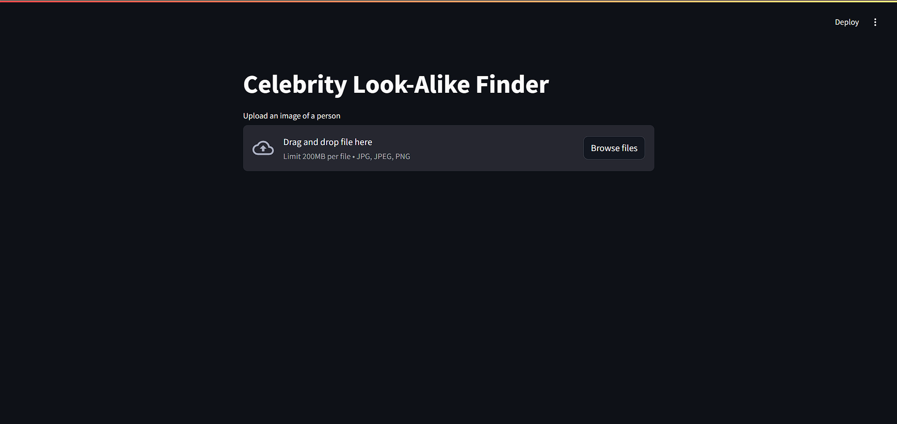
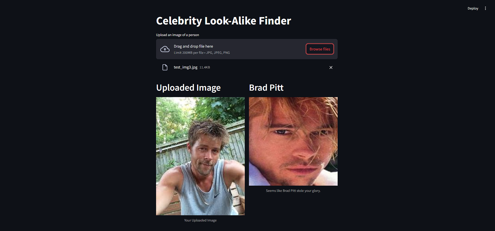

---

# Celebrity Look-Alike Finder

This project is a **Celebrity Look-Alike Finder** application built using **Streamlit** for the web interface, **FaceNet** for face embedding, and **MTCNN** for face detection. It takes an input image of a person and finds the most similar celebrity face from a pre-loaded dataset.

## Features

- **Upload an Image**: Upload an image of any person, and the app will detect the face.
- **Face Detection**: The app uses MTCNN to detect faces in the uploaded image.
- **Feature Extraction**: The face is processed using FaceNet to extract a 512-dimensional feature embedding.
- **Celebrity Matching**: The app compares the face embedding of the uploaded image to a pre-saved dataset of celebrity embeddings using cosine similarity to find the closest match.
- **Display Results**: The app shows the uploaded image alongside the predicted celebrity look-alike.

## Tech Stack

- **Backend**: TensorFlow, FaceNet, MTCNN, OpenCV
- **Frontend**: Streamlit for the web application
- **Data Processing**: NumPy, scikit-learn (cosine similarity), PIL (image processing)
- **Serialization**: pickle for saving and loading feature embeddings and filenames

## Dataset

The dataset consists of images of various celebrities. The faces in the images are detected and cropped using MTCNN, and their embeddings are extracted using FaceNet for later comparison.

## Project Structure

```bash

.
├── test.py      
├── app.py                     # Streamlit application for celebrity look-alike detection
├── extracted_features.pkl      # Precomputed FaceNet embeddings for celebrity images
├── filenames.pkl               # List of file paths to the celebrity images
├── Celebrity Faces Dataset     # Directory with celebrity images (not included in repo)
└── README.md                   # Project README file
```

## Setup

### Prerequisites

- Python 3.7+
- TensorFlow 2.x
- Streamlit
- OpenCV
- Keras FaceNet (keras-facenet package)
- MTCNN

### Install Dependencies

```bash
pip install streamlit tensorflow keras-facenet mtcnn opencv-python-headless scikit-learn
```

### Run the App

1. Clone this repository:
   ```bash
   git clone https://github.com/yourusername/celebrity-look-alike-finder.git
   ```
2. Navigate to the project directory:
   ```bash
   cd celebrity-look-alike-finder
   ```
3. Run the Streamlit app:
   ```bash
   streamlit run app.py
   ```

4. The app will open in your browser at `http://localhost:8501`. You can now upload an image and find your celebrity look-alike.

5. Build from scratch(optional): To build the project locally from scratch execute the optional code in test.py with uncommented code and then run app.py

## Example Usage

1. Upload an image of a person.
2. The app detects the face, processes it, and finds the closest celebrity match based on cosine similarity.
3. The uploaded image and the celebrity look-alike are displayed side by side.

## Screenshots

### App Interface



### Celebrity Look-Alike Result



## Acknowledgements

- [MTCNN](https://github.com/ipazc/mtcnn) for face detection.
- [FaceNet](https://keras.io/examples/vision/facenet/) for face embedding.
- Streamlit for the easy-to-build web application interface.

## License

This project is licensed under the MIT License - see the [LICENSE](LICENSE) file for details.

---

Replace any necessary URLs and placeholders like `https://your-screenshot-url` with actual data or links as per your setup. This `README.md` provides clear instructions on setting up and running the project on GitHub.
